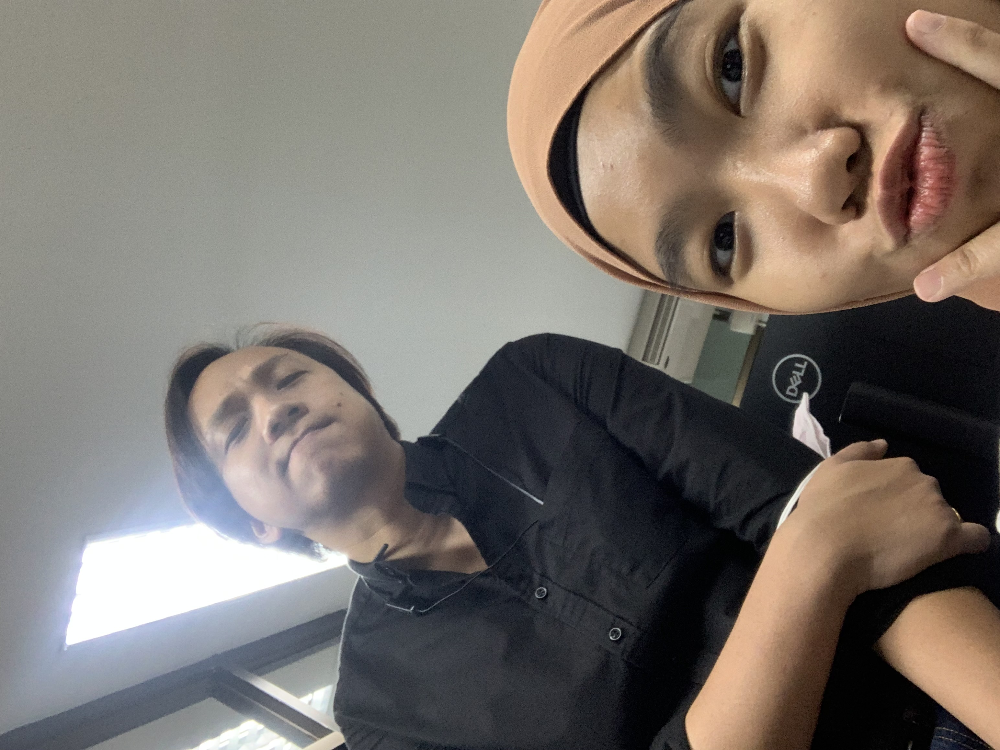

- Name(ENG) : Kanlaya Massilee
+ Name(TH) : กัลยา แมสซิลี
* Nicname : Pangpon
- Guest : Maykin
- * **Chat GPT** : Maintainability หมายถึงคุณลักษณะของซอฟต์แวร์หรือระบบที่ช่วยให้ง่ายต่อการบำรุงรักษา (maintenance) หลังจากการพัฒนาและการนำเข้าใช้งาน. คุณลักษณะนี้ออกแบบมาเพื่อทำให้การแก้ไขข้อผิดพลาด การปรับปรุง หรือการเปลี่ยนแปลงซอฟต์แวร์เป็นงานที่สะดวกและมีความคุ้มค่าที่สูง.

หากซอฟต์แวร์มีคุณลักษณะความสามารถในการบำรุงรักษาที่ดี (maintainability) จะมีลักษณะเหล่านี้:

1. **Modifiability (ความสามารถในการแก้ไข)**: ระบบสามารถถูกปรับปรุงหรือเปลี่ยนแปลงได้อย่างง่าย โดยไม่ต้องทำการเปลี่ยนแปลงที่เมื่อกี้ที่ระบบหลายส่วนและการแก้ไขจะไม่ส่งผลกระทบต่อส่วนอื่น ๆ ของระบบ.

2. **Testability (ความสามารถในการทดสอบ)**: ระบบสามารถทดสอบอย่างมีประสิทธิภาพ เพื่อค้นพบข้อผิดพลาดและปัญหาต่าง ๆ โดยใช้การทดสอบอัตโนมัติหรือการทดสอบมือ.

3. **Readability (ความสามารถในการอ่าน)**: รหัสซอฟต์แวร์มีโครงสร้างและความชัดเจนที่ทำให้อ่านและเข้าใจได้ง่าย.

4. **Documented (เอกสารสนับสนุน)**: ระบบมีเอกสารที่สนับสนุนที่อธิบายการทำงานและโครงสร้างของระบบ.

5. **Isolated Components (ส่วนแยก)**: ระบบแบ่งส่วนออกจากกันในการออกแบบและส่วนนึงไม่ควรมีผลกระทบต่อส่วนอื่น ๆ ของระบบ.

คุณลักษณะความสามารถในการบำรุงรักษาสำคัญเพราะทำให้การปรับปรุง การเปลี่ยนแปลง และการแก้ไขข้อผิดพลาดในระบบเป็นเรื่องง่ายและไม่มีความซับซ้อน ซอฟต์แวร์ที่ไม่ดีในคุณลักษณะความสามารถในการบำรุงรักษาอาจทำให้การจัดการแก้ไขและการบำรุงรักษากลายเป็นงานที่มีความยุ่งยากและแพงมาก.

